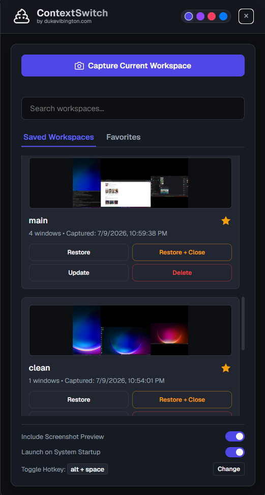

# ContextSwitch 🚀

An ultra-fast, lightweight desktop workspace and window layout manager built on **Tauri v2** and **Rust**. 

ContextSwitch runs quietly in the background as a system utility daemon, allowing you to instantly capture the geometry of all your active applications and restore them later with a single action or global hotkey.

---

## 📥 Installation (Windows)

1. Go to the [**Releases**](../../releases) page.
2. Download **`ContextSwitch_x64-setup.exe`** from the latest release.
3. Double-click the downloaded file and follow the installer.
4. That's it — ContextSwitch is now running in your system tray. Press **Alt+Space** to open the dashboard.

> **Note:** If Windows SmartScreen appears, click **"More info"** → **"Run anyway"**. The app is unsigned but open-source.

---

## ✨ Core Features

*   **Desktop Layout Capture & Restore**: Automatically records exact window coordinates, sizes, and states (normal, minimized, or maximized) for all running applications.
*   **Z-Order Focus Reconstruction**: Restores applications in the exact **reverse Z-order** of capture, ensuring your overlapping windows and focus layers are stacked perfectly.
*   **Stitched Multi-Monitor Previews**: Identifies all connected displays and dynamically generates stitched virtual monitor preview thumbnails of your saved workspaces.
*   **Global HUD Dashboard Overlay**: A borderless utility dashboard overlay that toggles instantly using a universal global hotkey. It takes topmost precedence over borderless apps and games.
*   **Customizable Global Hotkeys**: Bind any combination (e.g. `Alt+Space` or `Ctrl+Shift+H`) to show/hide the HUD, fully persistable in a local database.
*   **Launch on System Startup**: Toggle startup launch inside the dashboard. The app starts completely hidden in the background when your system boots, waiting for your hotkey.
*   **System Tray Integration**: ContextSwitch lives in your system tray. Left-click the icon to toggle the dashboard, right-click for quick actions, and the X button hides to tray instead of quitting.
*   **Sleek Multi-Theme Interface**: A beautiful glassmorphic panel equipped with multiple premium themes (Default, Kinetic Dark, Fluent Clarity Light Mode, Lumina Precision) standardized on the modern **Geist** font family.
*   **Local-First Architecture**: Zero cloud dependencies. Workspaces, window states, and configurations are stored in an atomic local SQLite database.

---

## 📸 How it Works


1. **Capture**: Arrange your IDE, browser, and documentation. Open ContextSwitch, click **Capture Current Workspace**, and name it.
2. **Restore**: Switch workspaces dynamically by clicking **Restore** (ambient repositioning) or **Restore + Close** (closes other applications for a completely clean layout).

---

## 🛠️ Development Setup (Contributors Only)

> This section is for developers who want to build from source. **Regular users should just [download the installer](#-installation-windows).**

### Prerequisites
*   **Node.js**: LTS version (v18+)
*   **Rust**: Stable toolchain (`rustup`)
*   **OS Build Tools**: Windows C++ build tools (via Visual Studio Installer)

### Run Locally
```bash
npm install
npm run tauri dev
```

### Build the Installer
```bash
npm run tauri build
```
Or simply double-click `build.bat` in the project root. The compiled installer will be located under `src-tauri/target/release/bundle/nsis/`.

---

## 📦 Automated Releases (CI/CD)

This repository uses GitHub Actions to automatically compile and publish releases, gated through Pull Request merges.

### How to release a new version:
1. Create a development branch and implement your changes.
2. Increment the version in `package.json` and `src-tauri/tauri.conf.json`.
3. Open a **Pull Request** targeting the `main` branch.
4. Once merged, the workflow automatically compiles the Windows installer and uploads it to a **Release Draft** for you to review and publish.

---

## 📄 License
ContextSwitch is open-source and released under the MIT License. Developed by **dukevibington.com**.
